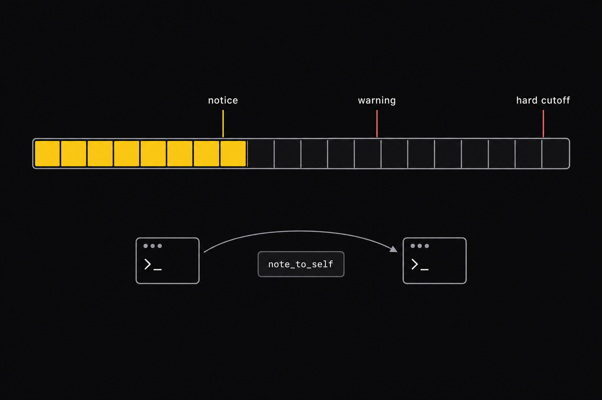
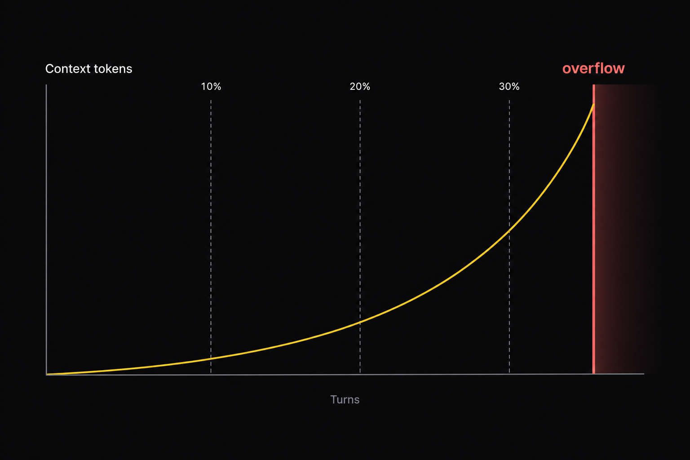
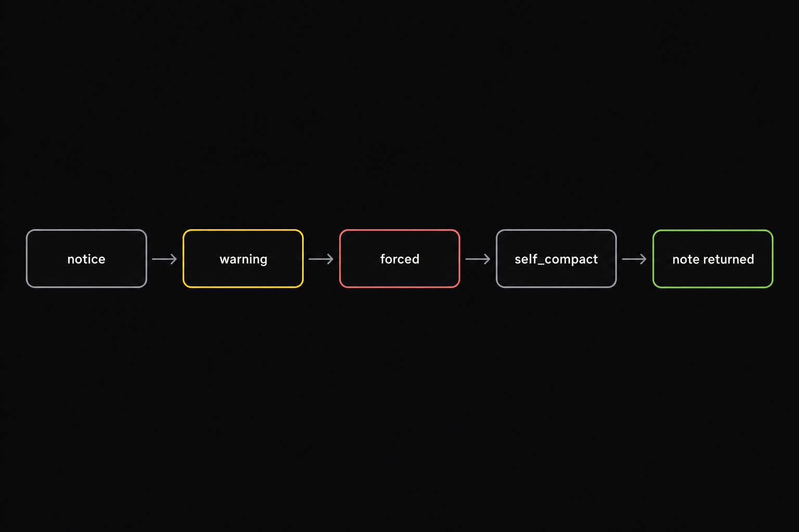
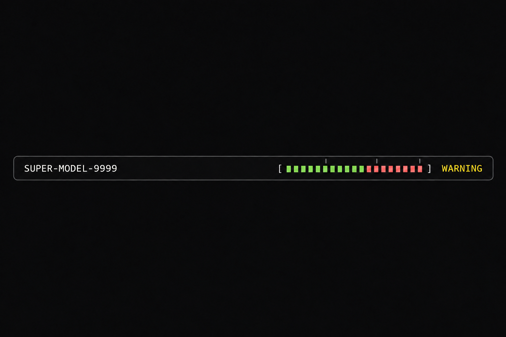
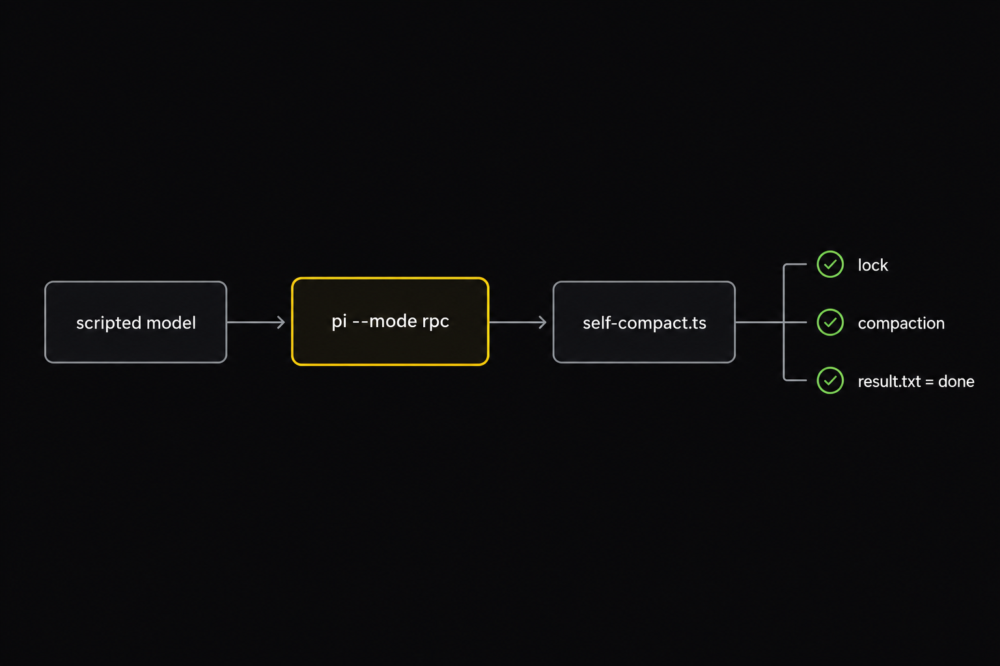

# Self Compact. A Pi agent that compacts its own context

> **Long-running (out-loop) agents cannot not wait for a human or 100% token window or to fire compaction.**
> A standalone Pi extension for autonomous, out-loop coding agents.

📺 Watch this video to get the full breakdown of this codebase: **[Self Compact on YouTube](https://youtu.be/3b0U4_02bAE)**

<p align="center">
  
</p>

<p align="center">
  
</p>

The agent watches its own context gauge. At the notice line it gets a hint, at the warning line it is told to write a handoff note, and at the hard cutoff every tool except `self_compact` is blocked. It writes a `note_to_self`, the context is compacted with a prompt you control, and the exact note comes back as the next message. **No human message, no lost intent, no restarted work.**

## Try It Out

Every recipe lives in the [`justfile`](justfile). Two commands and one prompt to watch an agent compact itself:

```bash
cp .env.sample .env                                       # 1. add OPENROUTER_API_KEY (one key, every model; just loads .env)
just run --model openrouter/deepseek/deepseek-v4.1-flash    # 2. launch Pi with the extension on a cheap, fast workhorse model
```

3\. Paste this prompt and answer `yes` each time the agent stops:

```
read every file in this code base in chunks of 10. Stop every 10 and ask for confirmation before moving to the next 10.
```

Every chunk adds tens of thousands of tokens to the context. Watch the footer gauge climb past the `~` notice marker and the `!` warning marker, then see the agent write its `note_to_self`, call `self_compact`, and carry on from the returned note. The shipped defaults are notice 10%, warning 20%, hard cutoff 30% of the model window (see `apps/self-compact/extensions/self-compact/defaults.ts`); on a 1M-token model that is about 105k / 210k / 315k tokens. To reach a cycle sooner, lower them: `just soft=5% warn=8% buffer=2% run --model openrouter/deepseek/deepseek-v4.1-flash` (about 52k / 84k / 105k). Keep the notice line well above Pi's retained recent history (`keepRecentTokens`, 20k by default), otherwise a compaction has nothing to cut. Inside Pi, `/self-compact-info` prints the live numbers at any time, asking the agent to call `view_context` shows you what it sees, and `just demo` walks the whole cycle with a scripted model and no API key. If OpenRouter answers with 429 rate-limit errors for that model, any other Pi model id works the same way (`pi --list-models deepseek` lists the other DeepSeek flash slugs).

---

## Install

### Agentic Install

```bash
# open this repo in Claude Code (or Pi) and run:
/prime            # loads the codebase context (.claude/commands/prime.md)
just demo         # zero-cost scripted model walks every threshold end to end
```

### Manual Install

**Prereqs:** [Pi coding agent](https://pi.dev) v0.85.1, [Node](https://nodejs.org) 24+, [just](https://github.com/casey/just), and a provider key in `.env` (`OPENROUTER_API_KEY` recommended, see [`.env.sample`](.env.sample); only live runs need it).

```bash
npm install -g --ignore-scripts @earendil-works/pi-coding-agent   # Pi
cp .env.sample .env                                                # add OPENROUTER_API_KEY; just loads .env on every recipe
just run --model openrouter/deepseek/deepseek-v4.1-flash             # shipped defaults: notice 10%, warning 20%, hard cutoff 30%
just test && just e2e                                              # unit + deterministic end-to-end, no API cost
```

There are no npm dependencies to install for the extension itself: Pi's loader supplies its packages at runtime and Node 24 strips the types for the tests.

---

## Why this exists

<p align="center">
  
</p>

Every turn of an autonomous agent re-sends its whole history. Quality decays as the window fills (context rot) and every call costs more than the last. Pi ships compaction, but it is reactive: it fires near the wall with a generic summary prompt, the agent gets no warning, and nothing carries the agent's own "what I was about to do" across the boundary. A summary written by a bystander is how finished work gets redone.

The fix is to hand the agent the gauge and the hand-off. **Thresholds it can see, a note it writes itself, and a compaction it triggers at a clean checkpoint.**

---

## How a cycle works

<p align="center">
  
</p>

| Phase | Trigger | What the agent gets | Tools |
| --- | --- | --- | --- |
| **notice** | usage crosses `--compact-soft-at` | one transient message with live numbers, optional guidance | all available |
| **warning** | usage crosses `--compact-at` | "time to compact soon", refreshed on every call | all available |
| **forced** | usage crosses warning + `--compact-buffer` (capped at 90 %) | every tool call is blocked with a reason naming `self_compact` | **only `self_compact`** |
| **handoff** | agent calls `self_compact({ note_to_self })` | note saved, run ends, compaction once idle, note returned verbatim | restored on success |

The guidance never enters the model's persisted context: it is injected into the next model call and dropped. Each crossing prints the full notice, warning, or forced message once in the terminal so you see exactly what the agent sees. The footer is yours, not the model's: `view_context` gives the agent the same numbers (used tokens, percent, thresholds, tokens left) as JSON whenever it asks, so it never has to guess where it stands. The only messages that persist are your prompts and the returned note. If compaction fails or is cancelled, the note and the lock survive, the extension retries, and `/self-compact-now` or `/compact` finish the job. Reload, resume, and `/tree` rebuild the handoff from the session, and an answered handoff never restarts.

> *The note is the contract. Content in, content out, byte for byte.*

---

## The footer

<p align="center">
  
</p>

```
 SUPER-MODEL-9999 · cycle 1                          [###~====-!-|--------] 40% NOTICE
```

Twenty cells at 5 % each. `#` cached, `=` not cached, `-` free. `~` soft, `!` warning, `|` hard cutoff. The phase tag turns yellow, orange, and red. While a note is saved and the compaction runs it reads `COMPACTING`, then `COMPACTED` until the note is back. At `FORCED` every tool except `self_compact` is blocked. `/self-compact-info` prints the same numbers in full without spending a model turn.

---

## Folder structure

```
self-compact/
├─ apps/self-compact/                    # the extension (the only app)
│   ├─ extensions/self-compact/
│   │   ├─ self-compact.ts               # entry: flags, tool, commands, events, footer, compaction override
│   │   ├─ defaults.ts                   # shipped thresholds: notice 10%, warning 20%, hard cutoff 30%
│   │   ├─ thresholds.ts                 # tokens / k / m / % parsing, 90 % cap, level
│   │   ├─ context-bar.ts                # 20-cell bar renderer
│   │   ├─ prompts.ts                    # prompt lookup, templating, precedence
│   │   ├─ summary.ts                    # native compaction call with the replacement summary prompt
│   │   └─ state.ts                      # state snapshot, durable handoff id, recovery
│   ├─ .pi/self-compact/                 # three editable prompt files (live values via {{placeholders}})
│   ├─ tests/                            # unit, harness (scripted provider + RPC client), e2e
│   └─ scripts/                          # verify.sh, tui-smoke.sh (logs go to a gitignored verification/ folder)
├─ specs/                                # planf3 HTML plans incl. specs/self-compact-merge.html
├─ ai_docs/                              # the Pi v0.85.1 doc bundle the build was grounded in
├─ prompts/end_draft_plan.md             # the original requirements
├─ images/                               # README images
├─ .env.sample                           # copy to .env; OPENROUTER_API_KEY recommended
└─ justfile                              # one recipe per job
```

---

## Commands

```bash
just run [pi flags]                    # shipped defaults: notice 10%, warning 20%, hard cutoff 30% of the model window
just soft=5% warn=10% buffer=5% run    # same launch with lower thresholds
just demo                              # scripted zero-cost model walks notice -> warning -> forced -> handoff
just test                              # unit tests
just e2e                               # deterministic end-to-end through the real pi CLI
just real                              # live run on openrouter/deepseek/deepseek-v4.1-flash (SC_REAL_MODEL overrides)
just verify                            # every deterministic check; logs land in apps/self-compact/verification/ (gitignored)
```

Inside Pi: `/self-compact-info` (settings, thresholds, usage, state, cycles, prompt sources, pending note) and `/self-compact-now` (asks the agent to write its note and call the tool, reusing a saved note on retry). Built-in `/compact` is untouched and uses the same summary override. The agent gets two tools: `self_compact(note_to_self)` and `view_context()`, which returns its usage, percent, and thresholds as JSON.

**Defaults and how to change them.** The shipped thresholds are one constants file: [`apps/self-compact/extensions/self-compact/defaults.ts`](apps/self-compact/extensions/self-compact/defaults.ts).

| Line | Default | CLI flag |
| --- | --- | --- |
| notice | `10%` of the model window | `--compact-soft-at` |
| warning | `20%` | `--compact-at` |
| hard cutoff | `30%` (warning + buffer, capped at 90 %) | `--compact-buffer` (default `10%`) |

Override any of them per launch without touching the file:

```bash
pi -e apps/self-compact/extensions/self-compact/self-compact.ts --compact-soft-at 15% --compact-at 40% --compact-buffer 5%
just soft=15% warn=40% buffer=5% run                            # same three flags through the justfile
```

Flags accept whole tokens (`270000`), `k`/`m` (`100k`, `1.5m`), or percentages of the model window (`20%`). `--compact-buffer 0` blocks at the warning line. `--compact-prompt "..."` replaces the summary system prompt literally; otherwise `.pi/self-compact/USER_PROMPT_COMPACTION_MESSAGE.md` does.

---

## How to run it end-to-end

<p align="center">
  
</p>

The deterministic suite launches the real `pi --mode rpc` with a scripted provider whose reported usage grows every turn. That makes every crossing, the lock, sibling blocking, compaction, failure, `--session` recovery, and the exact note round-trip repeatable and free.

```bash
just e2e                                        # lifecycle, sibling batches, note validation, failure/recovery, launch variants
just real                                       # live model: forced cutoff -> self_compact -> compaction -> note verbatim -> result.txt = done
just verify                                     # every deterministic check; logs land in apps/self-compact/verification/ (gitignored)
```

What you should see at the end of a real run: a `result.txt` containing `done`, written by the model **after** compaction, from the next action in its own note.

---

## Where it can still fail

- Usage is Pi's estimate. A single huge tool result can jump past a threshold before the lock engages; the next call is still blocked.
- The lock stops new tool calls. Tools already running when the note is saved finish on their own.
- A model can ignore the warning. That is why the forced phase exists: at the hard cutoff nothing but `self_compact` works.
- Compaction quality is model quality. The summary prompt is yours to edit, and the note is never replaced by the summary.
- Very small sessions have nothing to compact. Pi keeps the newest `keepRecentTokens` (20k by default) untouched, so `self_compact` refuses with that reason and the agent keeps working. Keep every threshold above that retained history.

---

## License

MIT — see [`LICENSE`](LICENSE).

---

## Master Agentic Coding

Prepare for the future of software engineering.

Learn tactical agentic coding patterns with [Tactical Agentic Coding](https://agenticengineer.com/tactical-agentic-coding?y=self-compact).

Follow the [IndyDevDan YouTube channel](https://www.youtube.com/@indydevdan) to improve your agentic coding advantage.

---

Stay Focused and Keep Building

- IndyDevDan
